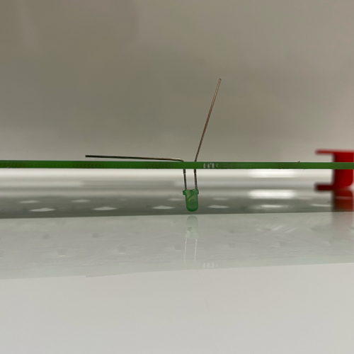

# Soldering Instructions for *Beatmaker's Sketchbook DIY v1*

Welcome to the soldering instructions for the *Beatmaker's Sketchbook DIY v1* and thank you for purchasing a kit from sucofunk.

Soldering all the components to the PCB and bringing *Beatmaker's Sketchbook* to life will take about 3-6 hours, depending on your skills.  
Please read the complete instructions guide and follow the instructions step by step in the described order.  
Some tasks may seem tedious, but in the end it will be satisfying and worth the work. ;)

### Parts

If you bought a complete kit from sucofunk.com, you are fine to jump to the next section.
Here is a picture of all the parts you should have received:

### Sourcing parts

If you are sourcing the parts by yourself, take a look at this BOM at Octopart: https://octopart.com/bom-tool/qJS5oQ3y

Pay attention that the microphone, display and slide switch could not be found on Octopart. Links to the right products are added to the description field. Pay attention to the description column, as there are some comments on similar parts and so on.

You need to solder the two PSRAM modules to the Teensy 4.1 by yourself. Check [this page](https://www.pjrc.com/store/psram.html) from PJRC for instructions. If you bought a kit, the modules are already soldered to the Teensy and tested.

### This is what the result will look like

By the end of this guide your project will look like this:

For reference, check these links to the higher resolution versions of the pictures:

- [Top](images/completeTopBig.png)
- [Bottom](images/completeBottomBig.png)

## 1. Preparation

To get started with soldering, you will need some preparation. First, get all the tools you need, then clean the big PCB for soldering.

### Tools you need
* Soldering Iron
* Solder
* Wire cutter
* Cutter knife
* Small screwdriver (+)
* Basic Multimeter (only "Resistor measurement" -> Ohm and "Continuity check" -> beep needed)
* Tape
* Lighter
* Alcohol to clean the PCB (do not use the lighter with the above mentioned alcohol) ;)
* In case you mess something up, a *desoldering pump* might be helpful
* A "third hand" might be helpful at some points, but is not needed. Check out [Omnifixo](https://omnifixo.com/) - it's perfect!
* Micro USB Cable to connect the Teensy Microcontroller to your PC

### Bring your skills up to date, if needed

If you are a complete beginner in soldering, you should learn the basics. There are plenty of videos on Youtube. A good recommendation is [this video](https://www.youtube.com/watch?v=QKbJxytERvg) from Collin's Lab.

In case you mess something up, you should be familiar with desoldering, too. Another recommendation is [this video](https://www.youtube.com/watch?v=N_dvf45hN6Y) from Collin's Lab.

If you need information on how to use a multimeter, reading [this article](https://learn.sparkfun.com/tutorials/how-to-use-a-multimeter/all) is a good starting point.

### Printed circuit board (PCB)

During this guide the sides of the main PCB are often mentioned. Here is the definition of top and bottom side:

### Remove Tabs from PCB

There are some tabs around the PCB which hold the Board in place while manufacturing. Most of the time, these tabs are not removed properly. You should remove them, otherwise the board might not fit 100% into the case and you might cut your fingers.
Depending on the size, use a wire cutter or a cutter knife to remove the tabs. Sanding paper might be helpful, if you are a perfectionist.

### Clean PCB

To prevent cold solder joints which might appear, if the solder pads are greasy, clean the whole board with alcohol. Isopropanol is a good choice. Some vodka might work, too. Just pay attention it is clear liquor without sugar ;)

Just use some fabric, drip some alcohol on it and wipe the board clean. Do not drown the PCB in alcohol. It will probably not harm, but we do not want it to get dizzy. ;)

If you feel the PCB gets greasy while working with it, repeat the step.

## 2. IC Sockets

Place the six IC sockets on the corresponding places on the top side and solder them from the bottom side. Don't worry, you cannot place them wrong, as long as you place them on the top side as shown in the pictures.  Yes, we are starting with a lot of soldering. ;)

**Pro Tip**: Place the ICs on the top side, cover the PCB and IC sockets with a sheet of paper, flip everything over and remove the sheet of paper. This way you do not have to hassle with the sockets ;)

**Why are we using IC sockets and do not solder the ICs directly to the PCB?** 
You can do it, if you want, but this way it is beginner friendly. You don't have to worry to kill the IC with too much heat or whatever could go wrong.

**What are the ICs for?**  
The five **big ICs** are Port expanders. They have 16 Input/Output pins and are used to identify button pushes (input) or light up our LEDs (output). In total these five ICs offer 80 input/output options. If we would connect all the buttons and LEDs to the teensy directly, there would not be enough pins. The Port expander ICs communicate via I2C Bus with the teensy. The I2C Bus only needs 2 PINs for communication and each IC has an interrupt connection to the teensy to send an interrupt signal, if an interrupt pin receives a signal (e.g. a button pressed or released). The teensy listens to the five interrupt (short: IRQ) pins and queries the corresponding IC via the I2C bus what happened. 
The **small IC** is an optical coupler and is used for incoming MIDI signals. With MIDI you are connecting another device to the Beatmaker's sketchbook and the optocoupler makes sure the external device is not interfering with our circuit. In a basic explanation it internally works with light. The incoming electrical power is triggering a light source and the optocoupler receives the light signals and transforms it into electrical signals for our circuit.

## 3. Note Keys

Mounting the "note keys" - the buttons which map the two octaves of the keyboard - is easy. This task is the one where you should work as neat as possible. Pay attention to place the buttons as straight as possible. If a button is not straight, you will always see it, when the key caps are mounted.

**A common source of defect** is bending down a button's connector pin. If it is not going through the PCB, you might not notice it when soldering the button from the backside and that button will not be connected and therefore not work.

## 4. Function Buttons & Program Button

These are the buttons to control Beatmaker's sketchbook: Function, Menu, Set, Switch, Play, Stop, Record, Input Selector, Left, Right, Up, Down. 
Just plug the 12 buttons on the top side into the PCB and solder them from the back side.

On the bottom side you need to plug the 13th button - the **Program button**. Do not forget to solder it on the top side of the PCB.  
In case the auto **upload** for the **firmware** does not work, you need to push this button to upgrade the firmware.  It can be used to perform a **hard reset** of the Teensy microcontroller, if you hold the button for more than 15 seconds.

## 5. Resistors, Capacitors & Diode

All the resistors, capacitors and the diode come in a small bag. Besides the bag you will find a sheet with designated areas where you should place the parts.

Now start from top to bottom and place each part at the described position on the PCB.

All parts from the sheet should be mounted on the top side of the PCB. After soldering, cut the remaining parts of the legs with a wire cutter.

If a resistor lost its label, you should use a multimeter to measure its Ohm value. If you do not own a multimeter, another option might be checking the coloured rings against a resistor table. You can find one [here](https://www.digikey.com/en/resources/conversion-calculators/conversion-calculator-resistor-color-code).

It is always a good idea to double check the resistors value before soldering it to the PCB.

### Resistors
Bend the resistor wires right at the edge of the resistor. This way it will fit straight into the PCB. Resistors do not have a polarity. It does not matter which way you put them on the PCB. Just place it the way you like it most - they are coloured! ;)

### Capacitors

The capacitors can be inserted directly into the PCB. You do not need to push them until the capacitor head reaches the PCB. If they touch the PCB - no problem. The capacitors in this kit do not have a polarity marker. Just place them as you like, but do not use/place/solder C3 - it's for experimental use only ;)

### Diode

The diode needs to be placed in the right direction at position D33. The black marker should be on the same side as the white line printed on the PCB.

## 6. Volume Potentiometer

To change the volume, a thumbwheel potentiometer needs to be mounted on the PCB.

Please note, that the volume potentiometer should be mounted from the bottom side, if you want to use the official enclosure.

The potentiometer is connected to an analog input on the Teensy microcontroller. From time to time the controller reads the current resistance of the potentiometer - a potentiometer is a variable resistor - and adjusts the output volume.

## 7. Line Jacks

Now it's time to mount and solder the line jacks. It's straight forward.

## Interlude - The PCB Holder

To make it easy to place different parts at the right position for mounting *Beatmaker's sketchbook* inside the enclosure with the plexiglas pane, the kit contains four 3D printed **PCB holder**. The main PCB needs to be placed in the small slot in the middle. Depending on the side you place the board on your workbench, the components will align at the right distance from the Main PCB.

In the upcoming sections the PCB holder is always mentioned. It is explained when and how to use it to make your soldering experience more fun.

## 8. Connectors and Pins

To connect the additional PCBs for audio input/output, power management, the brain a.k.a. Teensy 4.1, the amplifier to drive the speakers and the display, will be connected to the Beatmaker's sketchbook PCB via  connectors. The connectors need to be placed on the bottom side of the PCB and will be soldered on the top side. 
Take the two female 50-connector strips and the two 50-pin male strips and cut each into nine parts:

3 single connectors each will remain. We do not need them for this project. You can build something funny with it or save them for another project. You should never throw spare parts away. ;)

We will solder the pins in a later section - not now. So put them aside and continue with soldering the female connectors, first.

### Soldering

Now place the connectors and solder them as shown on the pictures. You should use the PCB holder to keep them in place. Pay attention that they are aligned in a 90° angle to the PCB. Otherwise you will get in trouble connecting the additional PCBs.

And a more detailed view. Do not forget the single connector "inside" the Teensy. It will connect the battery to power the brain. One of the most important connections. ;)

## 9. Microphone

Mounting the microphone is an easy task. Just place the microphone in the right position, as shown on the picture and solder.

## 10. Screen PINs

The screen will get connected in a slightly uncommon way and needs some attention. Take one 8 pin male connector strip and place it with the short legged side up through the main PCB from the top side.

Now, let's remove the black plastic strip. There are different options to remove it. The one that always works - and is probably the most brutal one - is cutting it with the wire cutter, remove it pin by pin and straighten the pins again, as shown in the next pictures.

**Why?** When the display is connected with female connectors and placed on these pins, the screen is placed right below the plexiglas pane.

An **alternative option** would be to remove the plastic from the pins first, then place the pins into an eight pin female connector strip, place them and solder the male pins from the bottom side of the PCB.

## 11. LEDs

LEDs need to be placed in the right direction. The long leg is always connected to power (+) and the short leg needs to be connected to ground (-). Put the long leg through the round solder pad and the short leg through the squared solder pad as shown in the picture.

To position the LEDs right below the plexiglass cover for best visibility of the light, you should use the PCB holder.
To get the best result, a good recommendation is to break this step into three parts. Start with the **red** LEDs at position **D1-D8**. Place them on the PCB and turn the PCB around. Pay attention the LEDs are touching the ground and then solder only one leg of each LED.

When you are done, turn the PCB around and align the LEDs (with one not soldered leg this is pretty easy). They should all be in one line. The more precise you work, the better the result. Then turn the PCB around again and solder the second leg. When done, cut the remaining legs with a wire cutter.

When the red LEDs are in place, continue with the **green** ones. You should start with LED **D9 - D18** first. Once again. One leg fist, align, solder, cut.
Then continue with the remaining **green** LEDs **D19 - D32**.

Done with this step? Congratulations! This was the most tedious task of this project and more than half of the project is already finished.

## 12. Front- & Power-switch PINs

Up to the next hack! Soldering the connector pins for the fader and the fader LED might be a bit fiddly.

Take the angled 5 PIN connector, put it through the holes of the PCB and bend it to the +-45° angled position shown in the picture. Then hold it somehow in place - tape might help - and solder it. The PINs should not be directed to point off the board as it would not fit in the case afterwards.

Repeat the task with the angled, 2 PIN connector at the power switch position as shown in the picture.

## 13. MIDI Sockets

Mounting the MIDI connectors might be a bit difficult as they tend not to stay in place if you flip the PCB for soldering. It might be helpful to use some tape to hold them in place for soldering.

## 14. Headphone Jack

This step is straight forward. Plug the headphone jack in and just solder.

## 15. Install Teensy

### Remove the SD card

If you bought a kit from sucofunk.com, the SD card is already plugged in to the Teensy. It is recommended to remove the card before soldering the PINs to prevent accidents with your soldering iron and the plastic housing of the card ;)

### Adding PSRAM

You can skip this step, if you bought a complete kit from sucofunk.com. If you sourced the parts by yourself, now would be a good time to attach the memory. Check out this [tutorial](https://www.pjrc.com/store/psram.html) from PJRC on how to solder the PSRAM. Beatmaker's sketchbook needs two 8 MB modules.
If the pins (next step) are already mounted, it is going to be a bit more difficult.

### Solder Pins

Now fetch the pins back from where you stored them and take the two 24 pin strips, the 5 pin strip and the single pin and place them with the long side into the female connectors you soldered before.

Now it is a good moment to take the alcohol and clean the solder pads of the Teensy microcontroller. We do not want loose connections to the Teensy, as they are very hard to locate, if something is not working.

Then take the teensy and place it on the short, pointing upright, side of the pins. All pins need to go straight through the Teensy PCB as shown in the picture.

It's time to link the brain to the system. Pick up your soldering iron again and solder all 54 pins to the Teensy microcontroller. This task is one of the most tedious ones in the whole project, as the solder pads are very small. By now you should be a soldering pro - take a deep breath and solder. ;)

**Pro Tip**: Start by soldering the four corner pins first. This way the Teensy is fixed correct and soldering the other pins is a bit more easy, as the plastic that is holding the pins might deform a bit.

## 16. Audio Board

Repeat the last step with the Sucofunkey Audio Board. Pay attention to place it the right way! On one side the pins are labeled on both PCBs. Pay attention the labels on the main PCB and the audio board match - as shown in the picture.

## 17. Encoders

Now it is time to mount the four rotary encoders. If the PCB does not have mounting holes for the encoders "mounting clamp-pins", just cut them off with a wire cutter as shown in the pictures.

Then mount the encoders and solder them to the PCB. Repeat this step for all four encoders.

## 18. Place ICs

You soldered five IC sockets. Currently there are no ICs on the board. This needs to be changed now. Placing the ICs into the holders is easy, but you need to pay attention not to bend the pins. If the pins of the ICs are a bit too wide spread and do not fit into the holder, place the IC on a table and slightly push all pins at one side to bend them into the right position.

The orientation of the ICs is printed on the PCB. The sockets might cover the printed white outline of the IC a bit but it should be visible. The large ICs have a semicircle on one side. Place that side on the one printed on the PCB.
The small eight pin IC has a small dot on one corner. Place this side directing to the semicircle on the PCB. As shown in the pictures.

Do you remember what the ICs are used for? If not, jump back to the socket section and read again, if you are interested ;)

## 19. Display

To connect the display to Beatmaker's sketchbook you need to solder a eight socket female connector to the small display PCB as shown in the next image. You should hurry up when soldering the pins to the PCB as the display does not like too much heat.
Do not forget to remove the two nuts besides the connector strip with a screwdriver.

If it is soldered properly, just plug the screen to the main PCB.

## 20. Amplifier & Speakers

During one of the the last steps we connected the audio board, which outputs the audio signals from the Teensy to the analog world. But hey, it is impossible to hear anything from that audio board without speakers. Ok, you already soldered the headphone- and line-out jacks some steps ago, but that is not enough.

So we need a small amplifier and two speakers to make *Beatmaker's sketchbook* rock.

First take the small bag with the "3.7W Class D Amp" and attach all the pins and clamps as shown in the picture. DO not forget to solder ;)

Then plug the amp into the connectors you soldered before to the main PCB. They are labeled with "MAX98306". You cannot place it to a wrong place, as there is no other free 9 pin connector left on the board.

For a detailed solder guide and some further information to the amp, check out [this instruction](https://learn.adafruit.com/stereo-3-7w-class-d-audio-amplifier) from Adafruit.

Ok, amplification should not be a problem. You can set the gain with the small jumper, which is inside the bag. As there is a default gain setting, you can do this at a later stage, when you hear the output.

Now let's connect the speakers. There are two red and two black wires in the kit. Take them and solder them to the solder pads at the speakers. The polarity (+ and -) is written in the middle of the speakers. Solder the red wire to + and the black one to the - pad. Pay attention to direct the wired to the middle of the speaker as the wires will go through the middle of the 3D printed speaker shell.

Tin the ends of the wire by heating by heating it up with the soldering iron up and apply some solder. This keeps the inner wires straight

If you soldered all four wires to the two speakers, connect the ends of the wires to the amplifier. You need a small screwdriver for this task. Connect the **black wire of the left speaker** to **LOUT-** and the red wire of the left speaker to the connection right beside the black wire. Repeat this step for the right speaker by connecting the **black wire of the right speaker** to **ROUT-** and as you already guessed, connect the red wire to the position right beside the black wire. ;)  

Well done! We are done with soldering for now and ready to power the system up and check if your Beatmaker's Sketchbook is working.

## 21. Test

### Plug the SD card back in
As you might remember, you removed the SD card from the Teensy before soldering the pins. Now it is time to put the card back in.

### Powering the system for the first time

Here comes the moment you have been waiting for.. drumroll.. powering up your Beatmaker's sketchbook for the first time to see if everything is working.

If you bought a complete kit from sucofunk.com, the firmware is already installed on the Teensy. If not, you need to upload the firmware to the Teensy. Check [this guide]() on how to upload the firmware.

Now take a micro USB cable and plug it into the Teensy Microcontroller on one side and to a USB power source (e.g. your PC). Watch the screen. If it lights up and you see the screen shown in the next picture, you made it!

You do not see anything on the screen? Don't worry, unplug the micro USB cable and check out the troubleshooting guide.

If you are happy and see *Beatmaker's sketchbook* starting up, follow the next steps to check if everything is working as expected.

### Test if everything is working

There is a small test program within beatmaker's sketchbook firmware. To run it, you need to push the key combination *&lt;funk&gt;* + *&lt;switch&gt;* (SW5 + SW8) at the record collection after the loading screen.

Watch this video on how to check if the buttons, LEDs, encoders and fader are working:

https://www.youtube.com/watch?v=f6vcWZaS9UY

If you are testing everything at this point, you just connect the USB cable to the Teensy microcontroller and it will power on as soon as there is power coming in - no power switch needed.

If a certain button or LED is not working, there is probably a connection not soldered or has a cold solder joint. To find out where it is connected, check out the schematics. Each button, LED (not the fader LED) and encoder is connected to one of the MCP-23017 ICs. 

If a whole IC seems to be not connected, check its orientation in the socket and all connections of that IC. If the LEDs of an MCP-23017 are working, but nothing happens, when you push a button, then the interrupt pin to the teensy (pins 28-32 -> MCP1 - MCP5) is probably not properly connected.

## 22. Connect Fader, Fader LED and Power switch

Now it's time for some up-cycling. As everything seems to be working, the display cable is not needed anymore. If you did not need it until now, be happy - it would be used for troubleshooting if the display is not working in the first run.

We are re-using it for the power-switch and connecting the fader + LED to *Beatmaker's sketchbook*.

### Disassemble Display cable

Remove all connector housings of the cable, as shown in the picture. It is pretty easy, if you use a small screwdriver or a cutter knife and just lift the plastic that is holding the inside of the connectors up.

### Heat shrink tube

The next steps use the supplied heat shrink tube to bundle and optically hide wires. The plexiglas pane is transparent and you might see the coloured wires if they are not wrapped in a black tube. ;)

Using the heat shrink tube is straight forward. Cut it with the wire cutter or a cutter, slip it over the wires and heat it up with a lighter (or another source of hot air - ~200 °C). Watch it shrink and be happy.

## Power Switch

Take two wires, plug the longer connectors into the two connector Dupont housing, strip some heat shrink tube over it and plug the smaller connectors to the power switch. Connect one wire to the middle pin of the power switch and the other one to another pin.
The smaller connectors fit on to the power switch, but a bit solder helps to keep them in place. Then move the heat shrink tube and heat it up. The result should look as shown in the following picture.

Connect the power switch to the pins you soldered a few steps ago.

## Fader and LED

The fader and its LED will be connected in the same way as we connected the power switch. Yes, the five wires plus connectors fit through the heat shrink tube! ;)

The result should look like this:

Connect **VALUE** to **1'** (upper left) on the fader, **VCC** to **2'** (right below 1') and **GND** to **3'**.

A bit solder will help to keep everything in place.

### Mount fader LED

The legs of the LED need to be shortened. Do not cut them at the same length. Keep the difference between + and - to connect it right. **Long leg** to **LED+** and **short leg** to **LED-**.

Before soldering the LED to the cable, test if it is connected in the right way by using the test-tool from above again. Do not forget to plug the five pin connector to the front connectors of the main PCB. Pay attention to plug it in in the right orientation!

The legs of the LED may not touch each other to prevent a short circuit.

If everything is correct, use some solder and do not forget to apply the heat-shrink tube to isolate the legs.

## 23. Power Supply

To continue with this step, unplug the micro USB cable from Beatmaker's Sketchbook, if it is still connected.

### Preparing the teensy for battery power
If you are not using the power management board and do not power your Beatmaker's sketchbook from a battery, you should skip this step.

Otherwise you need to separate the two pads on the bottom side of your Teensy 4.1. The standard configuration is to use the Teensy with USB power. We will power the teensy from a battery. To not mix the GND from the USB and the battery (which will definitely harm the Teensy!), we need to decouple them by cutting the small trace with a cutter knife.

To make sure the trace is cut, you can use your multimeter and check if there is a connection or not. You can do this by using the continuity check, which beeps on most multimeters, if there is a connection between the two probes. Place one probe on each pad. If it beeps, there is still a connection. If it does not beep, we are done with this step.

### Battery charger

To give power to *Beatmaker's sketchbook* from a battery, we need to connect the battery charger module. It is a Power Boost 500 module from Adafruit. You need to solder the last 8 pin strip to the module. Pay attention to solder it upside down or in this case downside up as shown in the picture. When you plug it into the main PCB, the labels have to match. Pay attention to do everything right and **do not connect the LiPo battery before soldering**.

There is a USB jack in the *Power Boost 500 bag*. We do not need that plug for *Beatmaker's sketchbook*. Do not solder it and keep it with the spare pins and connectors. ;)

Now you can plug the battery in and if the blue LED is shining, there is some power in the battery and we are ready to go. Plug the Power Boost to the main PCB.

Now you can use the power switch to turn Beatmaker's sketchbook on/off.

Plugging in the USB cable will charge the battery from now on - of course there needs to be a power source connected to the other side of the USB cable ;)

## 24. Congratulations!

You made it!

If you already have an enclosure at hand, bring them together ;)
